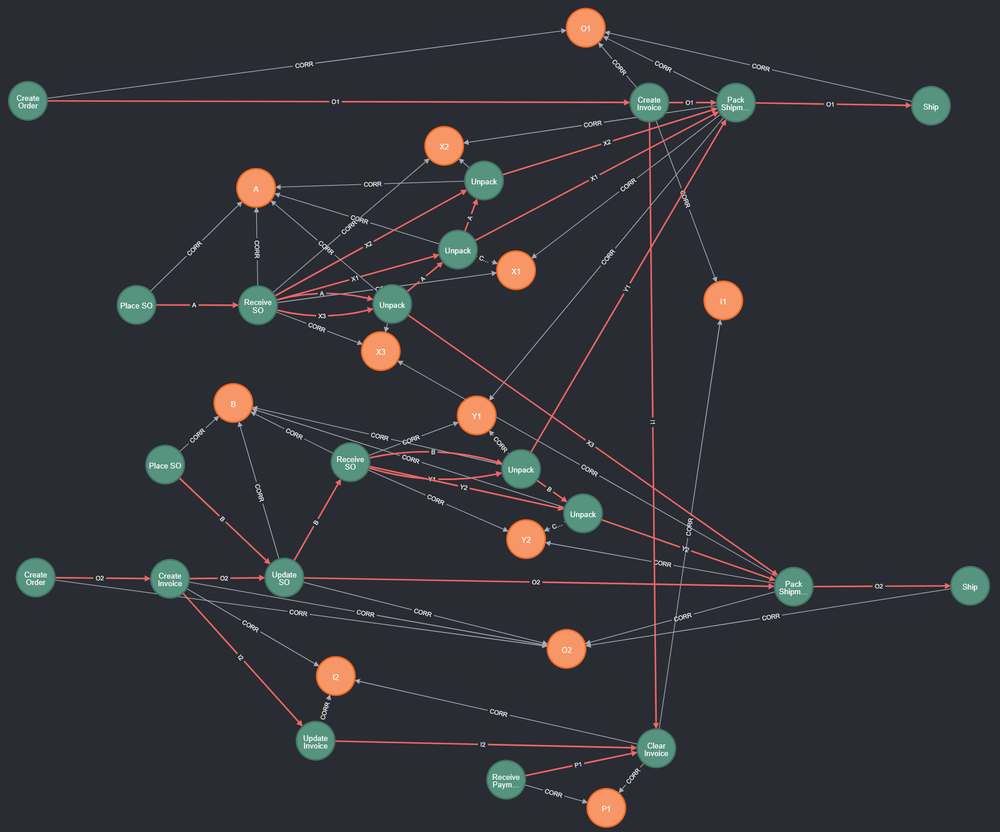
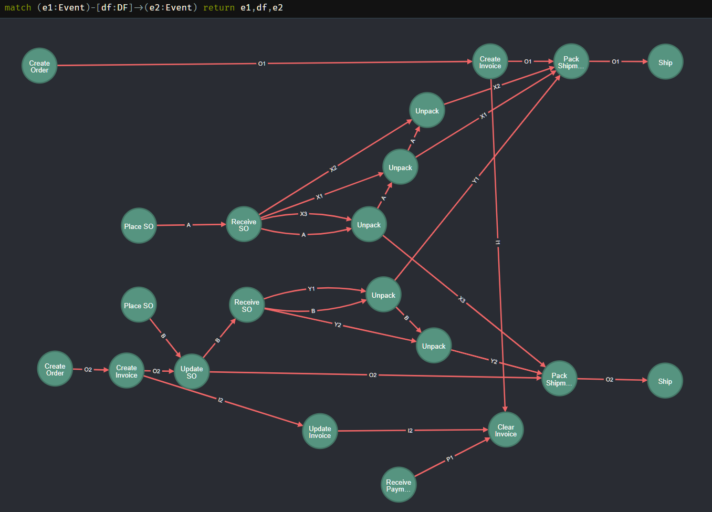
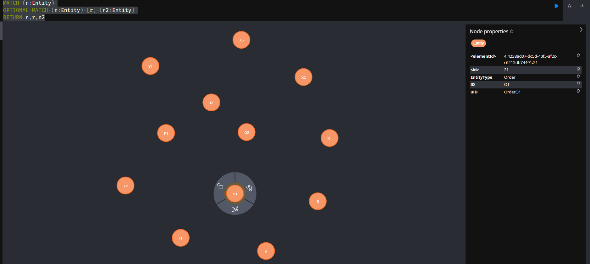
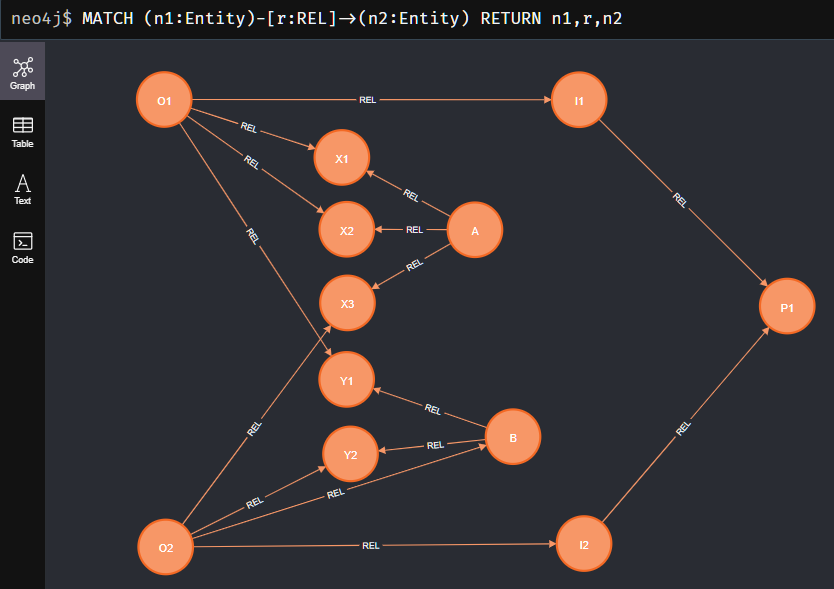

# Tutorial OCPM 1: Building and Analyzing Object Relations

This tutorial is part of a series of tutorials for realizing Object-Centric Process Mining (OCPM) with Event Knowledge Graphs (EKGs).

This tutorial explains queries for inferring relations between objects in your EKG. We cover
  * identfying relations between objects,
  * how to assign directions to relations, and
  * a simple but powerful object-centric process mining summary based on object relations

## 0. Prerequisites

  * You complete the [the tutorial on building event knowledge graphs](./tutorial-your-first-event-knowledge-graph.md)
     * You have a running instance of Neo4j
     * You have imported events and constructed an EKG

## 1. Understanding what a basic Event Knowledge Graph contains and what is lacks

Through the [tutorial](./tutorial-your-first-event-knowledge-graph.md) you should have constructed the following EKG 



It contains following types of nodes
  * **:Event** nodes describing occurrences of an activity at a particular point in time, furter described by various properties
  * **:Entity** nodes describing the process objects and other entities in the process
  * **:CORR** (correlation) relationships where  `(e:Event) -[:CORR]-> (n:Entity)` states that event *e* refers to entity *n*
  * **:DF** (directly-follows) relationships where `(e1:Event) -[:DF { ID:"o1" }]-> (e2:Event)` states that event *e1* is directly followed by event *e2* from the perspective of an entity *n* with `n.ID=o1`

To better understand it, we should look at the events and the objects separately.

### 1.1 Event Layer of the EKG

Querying only for events and df-relations with `match (e1:Event)-[df:DF]->(e2:Event) return e1,df,e2` shows us this **behavioral part** of the EKG



It describes the process execution in an object-centric way, ordering events not wrt. to a global case identifier but wrt. the individual objects the events are correlated to. See also the Open Access Book Chapter [Process Mining over Multiple Behavioral Dimensions with Event Knowledge Graphs](https://link.springer.com/chapter/10.1007/978-3-031-08848-3_9).

### 1.2 Object Layer of the EKG is missing object relations

We can query the object part of the EKG using
```
MATCH (n:Entity)
OPTIONAL MATCH (n:Entity)-[r]-(n2:Entity)
RETURN n,r,n2
```
which returns all :Entity nodes and (optionally) all relations between :Entity nodes. Doing so on this EKG only returns isolated :Entity nodes



The EKG contains no relations between entities (viz. objects) because we constructed the EKG from a data source (an event table) that only describes events and their relations to objects.

Much like the directly-follows relations between events, **we have to infer the object relations**. This is what we are going to do next.


## 2. Querying Related Objects

The first step to inferring object relations is to query which objects are related to each other. A basic heuristic is: **Two entities are related if there exists an event that refers to both entities.**

The following query returns the entities related in this way (here just their IDs). We do not relate entities of the same type to each other (for the same reason that we usually do not create foreign-key references between data entries in the same table of a relational database).

```
MATCH (n1:Entity)<-[:CORR]- (:Event)-[:CORR]->(n2:Entity) 
WHERE n1.EntityType <> n2.EntityType
RETURN DISTINCT n1.ID,n2.ID
```

This gives us the following table

| n1.ID | n2.ID |
|-------|------|
| "Y1" | "O1" |
| "X2" | "O1" |
| "X1" | "O1" |
| "I1" | "O1" |
| "I2" | "O2" |
| "B"  | "O2" |
| "Y2" | "O2" |
| "X3" | "O2" |
| "X3" | "A"  |
| "X2" | "A"  |
| "X1" | "A"  |
| "O2" | "B"  |
| "Y2" | "B"  |
| "Y1" | "B"  |
| "O1" | "X1" |
| "A"  | "X1" |
| "O1" | "X2" |
| "A"  | "X2" |
| "O2" | "X3" |
| "A"  | "X3" |
| "O1" | "Y1" |
| "B"  | "Y1" |
| "O2" | "Y2" |
| "B"  | "Y2" |
| "P1" | "I2" |
| "O2" | "I2" |
| "P1" | "I1" |
| "O1" | "I1" |
| "I2" | "P1" |
| "I1" | "P1" |

Although we use `DISTINCT` to exclude duplicate results, the table still contains redundant information as each related object pair is contained twice, e.g., *("O1","Y1")* and *("Y1","O1")*. This is due to the fact that from a data perspective, object relations are *undirected*, i.e., there is no natural direction between two object identifiers (that occur in the same event).

## 3. Assigning Directions to Relations using Time

To obtain *direction* in object relations, we have to apply context knowledge or domain knowledge, i.e., provide the relation with semantics.

Without any further information on the semantics of the objects in the data and the likely semantics of their relation, we have to resort to other heuristics. 

As our objects are associated to events, we can use the timestamp information of the related events to assign a direction to the relations. For instance, relations between objects point from the object that was created first to the object that was created later.

The following query finds all relations between entities in the order of their creation. It return a directed relation record *(n1,n2)* only if *n1*'s first event occurs before *n2*'s first event.

```
MATCH (n1:Entity)<-[:CORR]-(:Event)-[:CORR]->(n2:Entity) 
WHERE n1.EntityType <> n2.EntityType
WITH DISTINCT n1,n2
MATCH (e1:Event)-[:CORR]->(n1)
MATCH (e2:Event)-[:CORR]->(n2)
WITH n1, min(e1.timestamp) AS t1, n2, min(e2.timestamp) AS t2 
WHERE t1 < t2
RETURN n1.ID,t1,n2.ID,t2
```

Technically, we first query for the distinct pairs of events related to each other through a shared event. Then we query for the events correlated to each respective entity, looking for the respective earliest timestamps *t1* and *t2* and then restrict the results to those `WHERE t1 < t2`. The resulting table shows the entity IDs and the timestamps of their first events:

| n1.ID | t1 | n2.ID | t2 |
|----|----|----|----|
| O2 | 2021-05-01T09:30:00+01:00 | B | 2021-05-02T11:55:00+01:00 |
| O1 | 2021-05-01T09:05:00+01:00 | X1 | 2021-05-04T10:00:00+01:00 |
| A | 2021-05-01T11:25:00+01:00 | X1 | 2021-05-04T10:00:00+01:00 |
| O1 | 2021-05-01T09:05:00+01:00 | X2 | 2021-05-04T10:00:00+01:00 |
| A | 2021-05-01T11:25:00+01:00 | X2 | 2021-05-04T10:00:00+01:00 |
| O2 | 2021-05-01T09:30:00+01:00 | X3 | 2021-05-04T10:00:00+01:00 |
| A | 2021-05-01T11:25:00+01:00 | X3 | 2021-05-04T10:00:00+01:00 |
| O1 | 2021-05-01T09:05:00+01:00 | Y1 | 2021-05-07T10:10:00+01:00 |
| B | 2021-05-02T11:55:00+01:00 | Y1 | 2021-05-07T10:10:00+01:00 |
| O2 | 2021-05-01T09:30:00+01:00 | Y2 | 2021-05-07T10:10:00+01:00 |
| B | 2021-05-02T11:55:00+01:00 | Y2 | 2021-05-07T10:10:00+01:00 |
| O2 | 2021-05-01T09:30:00+01:00 | I2 | 2021-05-03T16:15:00+01:00 |
| O1 | 2021-05-01T09:05:00+01:00 | I1 | 2021-05-06T14:35:00+01:00 |
| I2 | 2021-05-03T16:15:00+01:00 | P1 | 2021-05-09T08:30:00+01:00 |
| I1 | 2021-05-06T14:35:00+01:00 | P1 | 2021-05-09T08:30:00+01:00 |

## 4. Extending the EKG by Materialzing Object Relations

To be able to leverage the object relations in subsequent process mining analyses, we can materialize them in the EKG by adding a relationship between any two related :Entity nodes.

## 4.1 Materializing Object Relations

The following query materializes object relations the directed object relationships based on the timestamps of the associated events.

```
MATCH (n1:Entity)<-[:CORR]-(:Event)-[:CORR]->(n2:Entity) 
WHERE n1.EntityType <> n2.EntityType
WITH DISTINCT n1,n2
MATCH (e1:Event)-[:CORR]->(n1)
MATCH (e2:Event)-[:CORR]->(n2)
WITH n1, min(e1.timestamp) AS t1, n2, min(e2.timestamp) AS t2 
WHERE t1 < t2
MERGE (n1)-[:REL]->(n2)
```

It only differs in the last statement `MERGE (n1)-[:REL]->(n2)` which creates the relationship from *n1* and *n2*. 

We here use the rather generic and not very meaningful label *:REL* to describe (that there is) a relation between two objects. In a proper data model, this relationship would be correctly typed to indicate the semantics of the relation, e.g., 'child-of', 'produced-by', etc. For the sake of simplicity of these tutorials we stick to *:REL* as it will also allow us subsequently to write generic queries involving object relations of any kind.

## 4.2 Querying the Object Layer of the EKG with Object Relations

We can now query the object-relation graph in our EKG with `MATCH (n1:Entity)-[r:REL]->(n2:Entity) RETURN n1,r,n2` which result in this graph.



## 4.3 A High-Level Execution Summary

This graph nicely summarizes for us the process executions on a higher level of abstraction by modeling the ordering of the involved objects. We can see that:
  * the execution starts with Orders *O1* and *O2* and with Supplier Orders *A* and *B*
  * Order *O1* later relates to *X1*, *X2*, *Y1* - where *X1* and *X2* were supplied via *A* and *Y1* was supplied via *B*
  * Order *O2* later relates to *X3*, *Y2* - where *X3* was supplied via *A* and *Y2* was supplied via *B*
  * Order *O1* leads to Invoice *I1*
  * Order *O2* leads to Invoice *I2*
  * Both Invoices *I1* and *I2* are later related to (i.e. cleared by) Payment *P1*

This interpretation does require some knowledge of the semantics of the objects, but an analyst who has this knowledge can in this way make sense of the process on a higher level of abstraction without having to engage with the more complex events and event relations.

## 5. Wrap-Up

This tutorial covered 
  * Basic heuristics for querying which objects are related to each other - if this information is not present in the source data
  * Heuristics for assigning direction to a relation between objects (by considering the creation time of the object)
  * Extending the EKG by materializing (directed) object relations

By doing this, we established also a very useful tool for object-centric process mining analysis: by modeling the relations between objects in the direction of time, we obtain a **higher-level summary of the process behavior** that abstracts from individual events and **shows the main process flow in terms of related objects**.